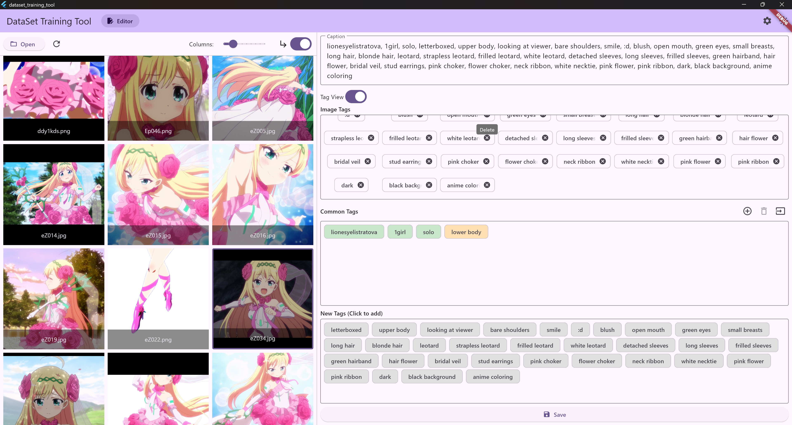

# DataSet Training Tool

<div align="center">
  <a href="https://flutter.dev" target="_blank">
    
  </a>
  <a href="https://dart.dev" target="_blank">
    
  </a>
  <a href="https://www.python.org" target="_blank">
    
  </a>
  <a href="./LICENSE" target="_blank">
    
  </a>
  <br>
  
  
  
</div>



A desktop application built with Flutter for efficiently managing and editing image dataset caption files, with an optional bundled Python AI backend ([AiApiServer](AiApiServer/)) for AI auto-tagging — designed for the data preprocessing stage of AI model training.

## ✨ Features

### Three-Column Workbench

The main interface is a "browse → preview/edit → tag management" three-column layout. Column widths are draggable and remembered across sessions.

#### Left: Assets Panel
- **Open directory / refresh / include subdirectories** to load all images in a folder.
- **Thumbnail grid** with `contain` scaling and a live column-count slider.
- **Tag filtering**: filter the gallery by dataset tags — show only images containing (or missing) a tag.
- **Single-click** to select and load into the workspace; **double-click** to open a separate native preview window.

#### Center: Preview & Caption Editor
- **Image preview above the editor**, with a draggable split.
- **Caption editing**: automatically loads the `.txt` file matching the image (extension configurable); save writes it back.
- **Tag view**: switch a comma-separated caption into chips — double-click to edit, delete, drag to reorder, with bidirectional sync to the text box.
- **AI compare mode**: AI results are shown side by side with the current caption; accept/reject tags one by one or apply all at once. A global exit-compare control lives in the top bar.

### AI-Assisted Tagging (AiApiServer)
- **Local / remote backend**: connects to [AiApiServer](AiApiServer/) (a Flask HTTP service, default `http://127.0.0.1:50051`) providing WD14-family taggers, multimodal caption models, RMBG background removal, and translation.
- **Model picker**: grouped by purpose, with server-provided metadata badges (size, language, capabilities).
- **Tunable parameters** (e.g. threshold) before running.
- **Batch tagging**: run over the whole directory serially with **overwrite** and **append** modes, progress display, and undo.
- **Batch recognize-only**: run recognition only — results land in each image's compare mode for per-image review before applying.

### Right: Tag Library & Dataset Tags

#### Tag Library
- **Common tag library**: import / incrementally add / export / clear — your standard tag set.
- **Tag groups**: assign tags to custom-colored groups, with a group-edit mode and per-group delete; import/export carries group info.
- **Smart comparison**: common tags **present** in the current image are highlighted green, **missing** ones orange; click to toggle.
- **New tag discovery**: tags present in the image but not in the library show in gray — single-click to add them.

#### Dataset Tags Panel
- **Global aggregation**: all tags across the dataset with occurrence counts and a sort toggle.
- **Click to filter** the gallery on the left.
- **Global batch edits**: rename / delete a tag across the whole dataset, with **undo**.

### Keyboard Shortcuts
| Shortcut | Action |
|----------|--------|
| `Ctrl+S` | Save current caption |
| `Ctrl+E` | Run AI recognition on the current image |
| `Ctrl+F` | Focus the tag library filter |
| `←` / `→` | Previous / next image |
| `Ctrl+Z` / `Ctrl+Shift+Z` (or `Ctrl+Y`) | Undo / redo batch tag operations |

### Image Preview Window
- **Separate native window**, freely resizable and movable.
- Scroll-wheel zoom, left-button pan, prev/next buttons, one-click "Fit to Screen" reset, and save-as.

### Settings
- **Multi-language**: built-in English and Chinese.
- **Themes**: light / dark / follow system.
- **UI font**: system default / HarmonyOS Sans / MiSans, downloaded on demand.
- **AI server URL** and **caption file extension** are configurable.
- **Persistence**: language, theme, window layout, directories, tag library, etc. are saved automatically; one-click reset available.

## 🚀 Quick Start

```sh
git clone <your-repository-url>
cd DataSetTrainingTool
flutter pub get
flutter run -d windows   # or macos / linux
```

For full per-platform environment requirements, release build steps, and the AiApiServer Python setup (including a CPU fallback when no GPU is available), see the guidelines:

> 📖 **[Environment & Build Guide](docs/ENVIRONMENT_GUIDE.md)** (Chinese)

## 🤖 AiApiServer (AI Backend)

AI tagging is powered by the [AiApiServer](AiApiServer/) subdirectory: a Python 3.12 + Flask HTTP service supporting Windows / macOS / Linux — CUDA-accelerated with an NVIDIA GPU, automatically falling back to CPU without one.

```sh
cd AiApiServer
pip install -r requirements.txt
python main.py    # listens on 0.0.0.0:50051
```

See the [Environment & Build Guide](docs/ENVIRONMENT_GUIDE.md) for setup details and [AiApiServer/README.md](AiApiServer/README.md) for the endpoint protocol.

## 📚 More Docs

- [Environment & Build Guide](docs/ENVIRONMENT_GUIDE.md) — per-platform builds, AiApiServer Python setup
- [Getting Started](wiki/Getting-Started-EN.md) / [Usage Guide](wiki/Usage-Guide-EN.md) / [Settings](wiki/Settings-EN.md)
- 中文 README: [README.md](README.md)

## 📄 License

This project is licensed under the **GNU General Public License v3.0**. See the [LICENSE](LICENSE) file for details.

## 👥 Authors

- **[Joycai](https://github.com/Joycai)** - Initial idea and contributions
- **Gemini (Google)** / **Claude (Anthropic)** - Coding and implementation
