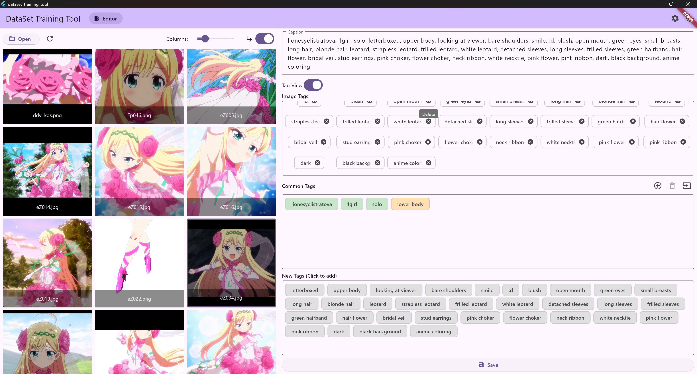

# DataSet Training Tool

<div align="center">
  <a href="https://flutter.dev" target="_blank">
    
  </a>
  <a href="https://dart.dev" target="_blank">
    
  </a>
  <a href="https://www.python.org" target="_blank">
    
  </a>
  <a href="./LICENSE" target="_blank">
    
  </a>
  <br>
  
  
  
</div>



A desktop application built with Flutter for efficiently managing and editing image dataset caption files, with an optional bundled Python AI backend ([AiApiServer](AiApiServer/)) for AI auto-tagging, plus a chat-based AI assistant that can operate on your whole dataset — designed for the data preprocessing stage of AI model training.

## ✨ Features

### Three-Column Workbench

The main interface is a "browse → preview/edit → tag management" three-column layout. Column widths are draggable and remembered across sessions. The AI Assistant lives in its own floating panel in the bottom-right corner and doesn't take up any of the three columns' width.

#### Left: Assets Panel
- **Open directory / refresh / include subdirectories** to load all images in a folder.
- **Thumbnail grid** with `contain` scaling and a live column-count slider.
- **Subdirectory switcher**: when the images under the chosen directory are spread across more than one subfolder, a dropdown appears (with each folder's image count). Switching to a subfolder narrows tag stats, global batch edits, and the AI assistant to that folder alone — an exact match on the image's own directory, not a recursive subtree match (a deeper nested folder that holds images shows up as its own separate entry).
- **Tag filtering**: more than a single has/lacks toggle — it's a nestable boolean-expression builder. Each group's conditions (has tag / lacks tag) combine with one AND or OR, and groups can nest inside groups to build arbitrarily parenthesized expressions for picking out exactly the images you want.
- **Single-click** to select and load into the workspace; **double-click** to open a separate native preview window.

#### Center: Preview & Caption Editor
- **Image preview above the editor**, with a draggable split.
- **Multiple caption types**: an image can carry several caption files side by side with different extensions (e.g. a tag-style `.txt` next to a natural-language `.ntxt`), configured in Settings (name, extension, enable/disable). The rest of the app always works against whichever type is currently "active".
- **Sentence mode**: flag a caption type as "prose" and the tag view segments its text by comma/period into phrases instead of treating it as comma-separated danbooru tags — a better fit for natural-language descriptions.
- **Caption editing**: automatically loads the caption file matching the image (extension configurable); save writes it back.
- **Tag view**: switch a comma-separated caption into chips — double-click to edit, delete, drag to reorder, with bidirectional sync to the text box.
- **Insert anchor**: tap the small handle beside any tag to make it the "anchor" — every tag added afterward (typed by hand, clicked from the tag library, or accepted from AI suggestions) is inserted right after it, and the anchor then jumps to the tag just inserted, so a whole sequence lands in click order. The anchor is remembered *by tag name* across images: switching images reactivates it if that image has the same tag, and otherwise falls back to appending at the end without forgetting the remembered name.
- **Tag autocomplete**: typing a tag by hand suggests danbooru tags as you go, ranked by post count and coloured by category. `↑`/`↓` select, `Tab` or `Enter` completes, `F1` opens the tag's wiki. Completions are spelled using the same style settings as the AI tagger, so hand-typed and AI-suggested tags never diverge.
- **Your own tags**: tags used in the current dataset or held in the tag library that danbooru has never heard of — custom trigger words, your own character names — are suggested too, marked with a hollow dot and "your tag · N images in this dataset". They are guaranteed a slice of the list rather than being pushed out by danbooru tags sharing a prefix, and are inserted exactly as you spell them, with no style conversion. A dataset tag has to appear on at least **5 images** before it is suggested, so your typos don't get fed back to you; tag-library entries are exempt, since putting one there was already a deliberate choice.
- **Tag lookup**: right-click any tag (in the editor or the library) to see its danbooru post count and jump straight to its wiki or a post search. Tags the dictionary has never heard of report how many images in this dataset use them — forty means it's yours, one usually means a typo.
- **Tag translations**: give a tag a translation in the app's language, shown beside it (or on hover only, or off entirely). Translations are **display only and never written into a caption file**; one glossary per language, stored separately from the dictionary CSV, importable and exportable. The completion list and the tag menu also search *by* translation, so typing `长发` finds `long_hair`.
- **AI compare mode**: AI results are shown side by side with the current caption; accept/reject tags one by one or apply all at once. A global exit-compare control lives in the top bar.

### AI-Assisted Tagging (AiApiServer)
- **Local / remote backend**: connects to [AiApiServer](AiApiServer/) (a Flask HTTP service, default `http://127.0.0.1:50051`) providing WD14-family taggers, multimodal caption models, RMBG background removal, and translation.
- **Model picker**: grouped by purpose, with server-provided metadata badges (size, language, capabilities).
- **Tunable parameters** (e.g. threshold) before running.
- **Batch tagging**: run over the whole directory (or the current filtered subset) serially, with **overwrite** and **append** modes, plus a **Sheet mode** that applies a saved "character sheet" rule set (see "Character Sheet skill" below). Comes with progress display and undo.
- **Batch recognize-only**: run recognition only — results land in each image's compare mode for per-image review before applying.

### AI Assistant

A chat panel that can operate on your whole dataset for you — open it with the ✨ icon in the top bar. It's a draggable, resizable **floating** window (docked bottom-right by default, or collapsible to just its title bar) rather than a fourth column, so it never eats into the main workbench's width; its position, size, and open/closed state are all remembered.

- **Multiple backends**: OpenAI, Gemini (via its OpenAI-compatible endpoint), native Anthropic, and locally-run Ollama are all supported. A button under the panel title switches between configured models at any time. Switching backends always starts a brand-new session with no carried-over context, since the tool set and context window are tied to the specific model.
- **What it can do**: read dataset overviews, search and page through images by tag, read multiple images' captions; delete a tag dataset-wide, replace a tag, insert a new tag beside an existing one, add tags at a given position across many images, **re-sort every caption's tag order in one pass** against a priority list (much faster than adjusting images one at a time), or overwrite a single image's caption. With more than one caption type enabled, it can also audit which type each image has and read/write a specific type's files (e.g. "write a natural-language sentence from this image's WD14 tags"). With a vision-capable model configured, it can look at images directly for a spot check. Every write is confirmed one at a time by default (or you can allow all writes for the rest of the conversation), and everything it does can be undone.
- **Tag library tools**: ask it to categorize your tag library and it reads the current groups, then files every tag in one pass — reusing your groups wherever it can and inventing new ones (with an automatic color) only when a batch really needs them. It can also add tags to the library, rename a group, remove tags, and delete a group (whose tags fall back to Ungrouped). Removing and deleting ask for confirmation; nothing here touches a caption file.
- **Tag translation tools**: it can bulk-fill translations for untranslated tags in the dataset — character/copyright/artist names are looked up on danbooru's `other_names` rather than invented, existing translations are left alone by default, and it writes at most 200 entries per call with a per-conversation cap on how many times it can query danbooru.
- **Prompt presets**: save prompts you use often and drop them into the input with one click from the panel's bookmark-icon menu — it only fills the input, never auto-sends, so you can still add a detail before running it. The same menu also hosts the built-in "skills" entry.
- **Character Sheet skill** (built in): fill out a one-shot form describing a character's fixed traits (hair, eyes, etc.), each garment's evidence rule, and any conflicting tags to strip. The assistant samples the dataset with the tagger to learn its actual vocabulary and produces a set of "merge rules" for you to review — nothing is written to any caption at this stage. Once you approve the rules, open Batch Tagging, pick **Sheet mode** and that rule set, and it re-runs the tagger and writes captions across the (optionally filtered) dataset.
- **Session token budget**: cap how many tokens a single conversation can spend (500K/1M/2M/5M, or 0 for unlimited — default 1M) in Settings. Every turn resends the full history, so batch work burns through it fast; once the cap is hit, start a new conversation. The input footer shows current usage and turns amber near the limit.
- **Follows the subdirectory scope**: switch to a subdirectory and the assistant can only see and edit images inside it, so it can't accidentally touch the rest of the dataset.

### Right: Tag Library & Dataset Tags

#### Tag Library
- **Common tag library**: import / incrementally add / export / clear — your standard tag set.
- **Tag groups**: assign tags to custom-colored groups. In organize mode, up/down arrows step a group's position (with a slide animation), and tapping a group's color dot opens either a preset-swatch palette or a full color picker; import/export carries group info.
- **Folding**: click a group header to fold or unfold it — folded state survives a restart. A toolbar button folds or unfolds everything at once. Each group shows **two rows** of tags at most; the rest hide behind "+N more" until you open them, so one 30-tag group cannot swallow the whole column.
- **Per-group usage**: the header's "6/9 used" says how many of the group's tags are already on the current image.
- **Status filter**: four pills slice the library by the current image — **All / Used / Unused / New** ("new" = on the image but not in the library).
- **Current dataset only**: a switch that hides library tags this dataset never uses, and says how many it hid — a library shared across datasets does not have to be spread out in full every time.
- **Chinese and pinyin search**: the filter matches the tag itself, its **translation**, and the translation's **full pinyin** (`长发` → `changfa`) and **initials** (`cf`).
- **Organize mode**: the checklist icon turns clicks into selection (`Shift`-click for a range). A bottom bar offers **move to group / merge into one tag / delete**, and a selection can be **dragged straight onto any group header**. A merge optionally rewrites every caption in scope too — as one undoable operation.
- **AI grouping**: when the ungrouped bucket piles up, the star button on its header asks the model for one "tag → group" proposal per tag (reusing your existing groups where it can). Accept them one at a time or all at once; nothing changes until you do.
- **Smart comparison**: common tags **present** in the current image are highlighted green, **missing** ones orange; click to toggle.
- **New tag discovery**: tags present in the image but not in the library show in gray — single-click to add them.

#### Dataset Tags Panel
- **Global aggregation**: all tags across the dataset with occurrence counts and a sort toggle.
- **Click to filter** the gallery on the left (works with the boolean expression above).
- **Add tags globally**: a toolbar button opens a dialog to type one or more tags and choose where to insert them — start, end, or a specific 1-based position — in every caption, optionally scoped to just the currently filtered images; images without a caption file yet get one created.
- **Global batch edits**: rename / delete a tag across the whole dataset, with **undo**.

### Keyboard Shortcuts
| Shortcut | Action |
|----------|--------|
| `Ctrl+S` | Save current caption |
| `Ctrl+E` | Run AI recognition on the current image |
| `Ctrl+F` | Focus the tag library filter |
| `←` / `→` | Previous / next image |
| `Ctrl+Z` / `Ctrl+Shift+Z` (or `Ctrl+Y`) | Undo / redo batch tag operations |
| `↑` / `↓`, `Tab`, `F1` | Autocomplete list: select / complete / open the wiki (only while the list is open) |

### Image Preview Window
- **Separate native window**, freely resizable and movable.
- Scroll-wheel zoom, left-button pan, prev/next buttons, one-click "Fit to Screen" reset, and save-as.

### Settings
- **Multi-language**: built-in English and Chinese.
- **Themes**: light / dark / follow system, plus 6 selectable accent colors (Teal / Blue / Indigo / Violet / Rose / Green) — the chosen color doesn't just tint highlights, it derives the whole UI's neutral tones (background, panels, hairlines) too, so switching accents restyles the app.
- **UI font**: system default / HarmonyOS Sans / MiSans, downloaded on demand.
- **Caption type management**: add/enable/disable multiple caption types (each with its own name and extension), and flag any of them as "prose" (sentence segmentation instead of tag segmentation).
- **Tag dictionary**: ~11k danbooru tags ship with the app (offline, and the same vocabulary the WD tagger emits); the full top-100k dictionary — with aliases, artists and copyrights — can be downloaded with one click.
- **Edit the dictionary**: the manager in settings edits any tag's translation and note, adds tags danbooru does not have (with a category, ranked first in completions), imports and exports glossaries, and clears AI-produced translations in one action while keeping the hand-written ones.
- **Fetch from danbooru**: paste a danbooru URL (wiki page, post search or tag listing) or just a tag name to read its public API for the category, post count, `other_names` (danbooru's own foreign-language names, usually Japanese) and a wiki excerpt. All of it is offered as *candidates* — one click adopts one into the translation or the note, nothing is written for you. A tag danbooru has but the bundled dictionary lacks can be added with its real category in one action.
- **Let the assistant translate in bulk**: just ask it to translate the dataset's untranslated tags. It lists them busiest-first, looks characters, copyrights and artists up on danbooru's `other_names` rather than inventing a name, and writes back up to 200 at a time. Existing translations are **not** overwritten by default, and everything it writes is recorded as AI-produced — so a run you dislike clears in one action while your hand-written entries stay. These tools never touch a caption file.
- **LLM backend configuration**: manage multiple providers (endpoint + API key) and, under each, the models available from it (context window, max output, temperature, vision support, optional pricing) for the AI assistant and compare-mode recognition to use.
- **AI assistant settings**: the session token budget, whether write tools require confirmation, and managing prompt presets.
- **AI server URL** and **caption file extension** are configurable.
- **Export / import data**: packs the three things you build up by hand into one JSON file — **LLM backends** (API keys optional), the **tag library** (groups, their tags, the tags you added to the dictionary yourself, and the glossaries for *every* language), and **prompt presets**. Import it on a new machine to pick up where you left off. The bundled tag list and the downloaded full danbooru dictionary are left out — the app can fetch those again. On import you choose whether to keep what is already there or let the file win; **neither option ever deletes anything**.
- **Persistence**: language, theme, window layout, directories, tag library, etc. are saved automatically; one-click reset available.

## 🚀 Quick Start

```sh
git clone <your-repository-url>
cd DataSetTrainingTool
flutter pub get
flutter run -d windows   # or macos / linux
```

For full per-platform environment requirements, release build steps, and the AiApiServer Python setup (including a CPU fallback when no GPU is available), see the guidelines:

> 📖 **[Environment & Build Guide](docs/ENVIRONMENT_GUIDE.md)** (Chinese)

## 🤖 AiApiServer (AI Backend)

AI tagging is powered by the [AiApiServer](AiApiServer/) subdirectory: a Python 3.12 + Flask HTTP service supporting Windows / macOS / Linux — CUDA-accelerated with an NVIDIA GPU, automatically falling back to CPU without one. The AI Assistant's chat capability is separate: it connects to whichever LLM provider you configure yourself (OpenAI / Gemini / Anthropic / Ollama, etc.).

```sh
cd AiApiServer
pip install -r requirements.txt
python main.py    # listens on 0.0.0.0:50051
```

See the [Environment & Build Guide](docs/ENVIRONMENT_GUIDE.md) for setup details and [AiApiServer/README.md](AiApiServer/README.md) for the endpoint protocol.

## 📚 More Docs

- [Environment & Build Guide](docs/ENVIRONMENT_GUIDE.md) — per-platform builds, AiApiServer Python setup
- [Getting Started](wiki/Getting-Started-EN.md) / [Usage Guide](wiki/Usage-Guide-EN.md) / [Settings](wiki/Settings-EN.md)
- 中文 README: [README.md](README.md)

## 📄 License

This project is licensed under the **GNU General Public License v3.0**. See the [LICENSE](LICENSE) file for details.

## 👥 Authors

- **[Joycai](https://github.com/Joycai)** - Initial idea and contributions
- **Gemini (Google)** / **Claude (Anthropic)** - Coding and implementation
