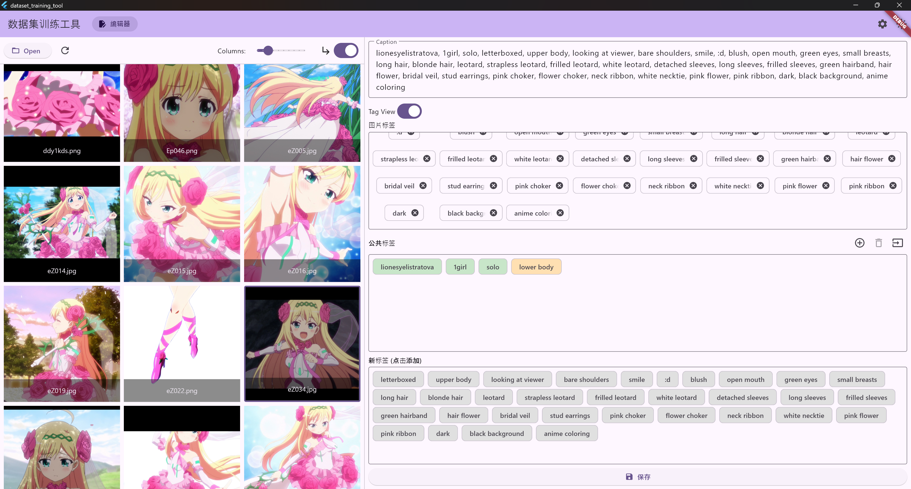

# 数据集训练工具 (DataSet Training Tool)



这是一个使用 Flutter 构建的桌面应用程序，旨在帮助用户高效地管理和编辑图像数据集的描述文件（captions），特别适用于 AI 模型训练的预处理阶段。

## ✨ 功能特性

### 编辑器界面
采用左右分栏布局，提供流畅的“选择-编辑”工作流。

#### 左侧：图片浏览器
- **打开目录**: 快速选择并加载包含图片的文件夹。
- **缩略图网格**: 以网格形式清晰展示目录下的所有图片。
- **文件名显示**: 每个缩略图下方都会显示对应的文件名。
- **自适应缩放**: 缩略图会以 `contain` 模式完整显示，避免裁剪。
- **动态列数调整**: 通过滑块实时调整每行显示的图片数量，网格自动适应。
- **包含子目录**: 可通过开关一键扫描并加载所有子目录中的图片。
- **刷新**: 随时重新扫描当前目录，更新图片列表。
- **图片预览**: **双击**任何图片，会打开一个独立的、功能丰富的预览窗口。
- **选中高亮**: **单击**图片会将其选中，并以蓝色边框高亮，同时在右侧工作区加载其数据。

#### 右侧：工作区
- **Caption 编辑**: 自动加载与所选图片同名的 `.txt` 文件（扩展名可在设置中修改），并显示在多行文本框中。
- **标签化视图 (Tag View)**:
  - 可通过开关将逗号分隔的 caption 文本转换为一系列独立的标签（Chip）。
  - **双击**标签可进行独立编辑。
  - 可删除单个标签。
  - 对标签的所有修改会**双向同步**回主文本框。
- **智能公共标签管理**:
  - **导入/添加**: 可批量导入或增量添加一个“公共标签”列表，作为你的标签库。
  - **智能对比**:
    - 图片中**包含**的公共标签会以**绿色**高亮。
    - 图片中**缺失**的公共标签会以**橙色**高亮。
  - **删除**: 可点选多个公共标签后，一键从公共库中删除。
- **新标签发现**:
  - 自动识别并展示图片中存在、但公共库中没有的“新标签”。
  - 新标签以**灰色**显示。
  - **单击**灰色标签可将其快速添加到公共标签库中。
- **保存**: 点击“保存”按钮，会将当前文本框中的所有内容写入或创建对应的 caption 文件。

### 图片预览窗口
- **独立原生窗口**: 预览窗口是一个可以随意缩放和拖动的独立操作系统窗口。
- **交互式查看**:
  - 使用**鼠标滚轮**进行缩放。
  - 按住**鼠标左键**进行拖动。
- **图片切换**: 通过窗口左右两侧的按钮，可以快速切换到上一张或下一张图片。
- **一键复位**: “Fit to Screen”按钮可以随时将图片的缩放和平移状态恢复到初始。
- **图片下载**: 可以将当前预览的图片保存到本地其他位置。

### 设置
- **多语言支持**: 内置中文和英文，并可轻松扩展。
- **主题切换**: 支持亮色、暗色和跟随系统三种主题模式。
- **持久化**: 所有设置（包括语言、主题、窗口大小、目录、标签库等）都会在应用关闭后自动保存，并在下次启动时加载。
- **自定义扩展名**: 可以自定义 caption 文件的扩展名（默认为 `.txt`）。
- **一键重置**: 可以将所有设置恢复到初始默认状态。

## 🚀 环境要求

在开始之前，请确保你的开发环境满足以下要求：

1.  **Flutter SDK**: 版本 `>=3.4.1`。
2.  **桌面开发环境**:
    -   **Windows**: 安装 Visual Studio 2022（或更高版本），并确保已勾选“使用 C++ 的桌面开发”工作负载。
    -   **macOS**: 安装最新版本的 Xcode。
    -   **Linux**: 安装 `clang`, `cmake`, `ninja-build`, `pkg-config`, `libgtk-3-dev`, `liblzma-dev` 等必要的构建工具。

## 🏃‍♂️ 运行项目

1.  **克隆仓库**
    ```sh
    git clone <your-repository-url>
    cd DataSetTrainingTool
    ```

2.  **获取依赖**
    ```sh
    flutter pub get
    ```

3.  **运行应用**
    根据你的目标平台，选择以下命令之一：
    ```sh
    # 运行 Windows 版
    flutter run -d windows

    # 运行 macOS 版
    flutter run -d macos

    # 运行 Linux 版
    flutter run -d linux
    ```

## 📦 打包发布

要创建可分发的桌面应用程序，请使用 `flutter build` 命令。

1.  **执行打包命令**
    ```sh
    # 打包 Windows 应用
    flutter build windows

    # 打包 macOS 应用
    flutter build macos

    # 打包 Linux 应用
    flutter build linux
    ```

2.  **找到可执行文件**
    打包完成后，你可以在项目的 `build` 目录下找到最终的应用程序：
    -   **Windows**: `build\windows\runner\Release\`
    -   **macOS**: `build\macos\Build\Products\Release\`
    -   **Linux**: `build\linux\<architecture>\runner\Release\`

## 📄 许可协议

本项目基于 **GNU General Public License v3.0** 许可协议。详情请参阅 [LICENSE](LICENSE) 文件。

## 👥 作者

- **[Joycai](https://github.com/Joycai)** - 初始想法与贡献
- **Gemini (Google)** - 主要编码与实现
