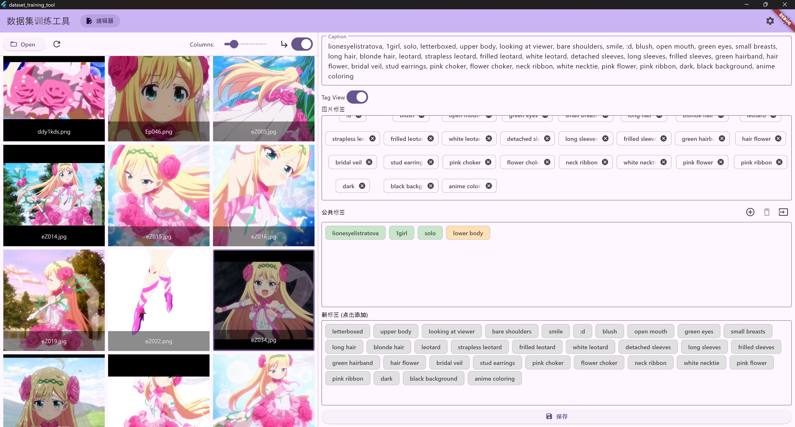

# 数据集训练工具 (DataSet Training Tool)

<div align="center">
  <a href="https://flutter.dev" target="_blank">
    
  </a>
  <a href="https://dart.dev" target="_blank">
    
  </a>
  <a href="https://www.python.org" target="_blank">
    
  </a>
  <a href="./LICENSE" target="_blank">
    
  </a>
  <br>
  
  
  
</div>



这是一个使用 Flutter 构建的桌面应用程序，用于高效管理和编辑图像数据集的描述文件（captions），并可搭配自带的 Python AI 后端（[AiApiServer](AiApiServer/)）完成 AI 自动打标，适用于 AI 模型训练的数据预处理阶段。

## ✨ 功能特性

### 三栏工作台

主界面为「资源浏览 → 预览/编辑 → 标签管理」的三栏布局，各栏宽度可拖动调整并自动记忆。

#### 左栏：资源面板
- **打开目录 / 刷新 / 包含子目录**：快速加载文件夹中的全部图片。
- **缩略图网格**：`contain` 模式完整显示，滑块实时调整列数。
- **标签筛选**：可按数据集标签过滤图库，只显示包含（或缺失）某标签的图片。
- **单击选中**加载到工作区；**双击**打开独立原生预览窗口。

#### 中栏：预览与 Caption 编辑
- **图片预览 + 编辑器上下分栏**，分割线可拖动。
- **Caption 编辑**：自动加载与图片同名的 `.txt` 文件（扩展名可配置），保存即写回。
- **标签化视图**：逗号分隔的 caption 可切换为标签（Chip）视图，支持双击编辑、删除、拖拽排序，改动与文本框双向同步。
- **AI 识别对比模式**：AI 结果与当前 caption 并排对比，逐个标签接受 / 拒绝后再写入，也可一键全部应用；顶栏提供全局退出对比。

### AI 辅助打标（AiApiServer）
- **本地 / 远程后端**：连接 [AiApiServer](AiApiServer/)（Flask HTTP 服务，默认 `http://127.0.0.1:50051`），支持 WD14 系列 tagger、多模态描述模型、RMBG 去背景、翻译等能力。
- **模型选择器**：按用途分组展示，附带服务端提供的元数据徽章（体量、语言、特性等）。
- **参数调节**：识别前可调整模型参数（如 threshold）。
- **批量打标**：对整个目录串行执行，支持**覆盖**与**追加**两种写入模式，带进度显示，可撤销。
- **批量仅识别**：只跑识别、结果进入各图片的对比模式，由你逐张审核后决定是否应用。

### 右栏：标签库与数据集标签

#### 标签库
- **公共标签库**：导入 / 增量添加 / 导出 / 清空，作为你的标准标签集。
- **分组管理**：标签可归入自定义颜色的分组，支持分组编辑模式、按组删除；导入导出携带分组信息。
- **智能对比**：当前图片**包含**的公共标签绿色高亮，**缺失**的橙色高亮；点击即可增删。
- **新标签发现**：图片中存在但库中没有的标签以灰色展示，单击快速入库。

#### 数据集标签面板
- **全局聚合**：统计当前数据集全部标签及出现频次，支持排序切换。
- **点击筛选**：选中标签即过滤左栏图库。
- **全局批量编辑**：跨整个数据集重命名 / 删除某个标签，操作可**撤销**。

### 快捷键
| 快捷键 | 功能 |
|--------|------|
| `Ctrl+S` | 保存当前 caption |
| `Ctrl+E` | 对当前图片执行 AI 识别 |
| `Ctrl+F` | 聚焦标签库筛选框 |
| `←` / `→` | 切换上一张 / 下一张图片 |
| `Ctrl+Z` / `Ctrl+Shift+Z`（或 `Ctrl+Y`） | 撤销 / 重做批量标签操作 |

### 图片预览窗口
- **独立原生窗口**：可随意缩放、拖动。
- 滚轮缩放、左键平移、左右按钮切换图片、一键复位（Fit to Screen）、另存图片。

### 设置
- **多语言**：内置中文和英文。
- **主题**：亮色 / 暗色 / 跟随系统。
- **界面字体**：系统默认 / HarmonyOS Sans / MiSans，选择后按需自动下载。
- **AI 服务器地址**、**caption 扩展名**均可自定义。
- **持久化**：语言、主题、窗口布局、目录、标签库等全部自动保存；支持一键重置。

## 🚀 快速开始

```sh
git clone <your-repository-url>
cd DataSetTrainingTool
flutter pub get
flutter run -d windows   # 或 macos / linux
```

各平台的完整环境要求、打包构建步骤，以及 AiApiServer 的 Python 环境配置（含无 GPU 时的 CPU 方案），请参阅指南文档：

> 📖 **[环境配置与构建指南](docs/ENVIRONMENT_GUIDE.md)**

## 🤖 AiApiServer（AI 后端）

AI 打标能力由子目录 [AiApiServer](AiApiServer/) 提供：Python 3.12 + Flask 的 HTTP 服务，支持 Windows / macOS / Linux，有 NVIDIA GPU 时走 CUDA 加速，无 GPU 时自动回退 CPU。

```sh
cd AiApiServer
pip install -r requirements.txt
python main.py    # 监听 0.0.0.0:50051
```

环境配置详情见 [环境配置与构建指南](docs/ENVIRONMENT_GUIDE.md)，端点协议见 [AiApiServer/README.md](AiApiServer/README.md)。

## 📚 更多文档

- [环境配置与构建指南](docs/ENVIRONMENT_GUIDE.md) — 各平台打包构建、AiApiServer Python 环境
- [入门指南](wiki/入门指南-CN.md) / [使用详解](wiki/使用详解-CN.md) / [设置说明](wiki/设置-CN.md)
- English README: [README.en.md](README.en.md)

## 📄 许可协议

本项目基于 **GNU General Public License v3.0** 许可协议。详情请参阅 [LICENSE](LICENSE) 文件。

## 👥 作者

- **[Joycai](https://github.com/Joycai)** - 初始想法与贡献
- **Gemini (Google)** / **Claude (Anthropic)** - 编码与实现
