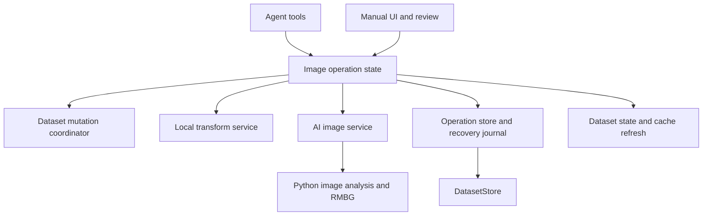

# Agent review and image preprocessing design

Date: 2026-10-05

Status: implemented with the initial limits below; automated validation passed.
Scope: the Flutter agent, dataset mutation boundaries, and the existing Python
image editor for preparing SDXL LoRA datasets. No new AI model was added.

## Implementation record

The original review and design below are retained as design context; their
source line numbers describe the pre-implementation checkout.

| Area | Implemented behavior |
| --- | --- |
| Runtime safety | Run-local cancellation reaches caption writes and HTTP requests. Folder switching cancels and awaits agent, image, caption, and batch-tag work. Pending approvals bind to scope, caption type, and caption contents. Cancellation after approval prevents dispatch. All-failed tagging reports an error. |
| Planning | Strict typed recipes; source/caption SHA-256 fingerprints; immutable target mapping and digest; portable collision checks; same-stem ambiguity and symlink rejection. All configured and unknown same-stem companions are carried byte-for-byte. |
| Local images | Crop in oriented source pixels; aspect-preserving fit, center crop and padding; optional upscale; PNG/JPEG encoding; byte-preserving copy/rename; explicit JPEG flatten color; EXIF orientation baked and EXIF removed; embedded ICC profile retained. |
| File execution | Separate sibling output by default; explicit in-place replacement; staged outputs verified against stored hashes; durable backups and paired image/caption journal; partial completion; explicit recovery/undo after restart; newer-edit conflicts refuse undo. |
| UI | Assistant panel → Image preprocessing works without an LLM profile. Before/after review, full target mapping, progress, cancellation, saved-operation lookup, and undo/recovery have Chinese and English UI text. In-place changes refresh selection, editor, image cache, AI results, and external preview. |
| Agent tools | Inspection, model discovery, plan, preview, apply, list/status, and undo tools share the manual workflow. Apply/undo require executor write authorization. Non-vision chat models receive preview metadata without image attachments. |
| AI images | New `/v1/imageprocessing/capabilities` and `/v1/imageprocessing/foreground` contracts return orientation-normalized RGBA PNG. Existing `/editimage` remains unchanged. Foreground crop uses the thresholded mask bounds and configurable margin. |
| Validation | Unit/transaction tests use real temporary files and injected failures; widget tests cover English/Chinese review; backend contract tests use a stub editor, with lightweight CI coverage. |

The source layout follows the proposed layers with fewer files: operation
results and previews live beside `ImageOperationPlan`, the existing `TagOps`
lease coordinates mutations, and the two image tool packs share
`image_preprocess_tools.dart`. `OperationContext` is a model-layer, run-local
context propagated through async zones, preserving the existing handler API.
`DatasetStore` remains the dataset I/O boundary.

Initial limits and explicit choices:

- Up to 200 images per plan, 40 megapixels per decoded/intermediate/output image,
  and 100 MiB per asset. Animated/multipage inputs are rejected.
- Output encoders are PNG and JPEG; `keep` copies original bytes for rename-only
  operations. Resize starts at 1024 × 1024 fit, with upscaling off. The manual UI
  uses white for JPEG flattening/padding; agent recipes can specify RGB colors.
- Foreground cropping encloses the entire mask; it does not select a named
  object or distinguish multiple subjects. Empty/tiny masks fail. Review
  previews and output images before training; no model-quality claim is made.
- Review displays up to four before/after samples and the full file mapping.
  Backups and journals are retained in `<source>/.dataset-toolkit/<operation-id>`
  with no automatic expiry. These artifacts are excluded from dataset scans.
- A failed paired commit is marked `recovery_required` and retains its journal,
  backups and partial outputs for explicit recovery. Already completed items are
  reported separately. Cancel finishes the current pair, then skips later items.
- Fingerprint checks provide optimistic conflict detection; portable filesystem
  operations cannot lock out arbitrary external processes atomically. Avoid
  external editors during apply/undo. Caption undo history is cleared after
  in-place image changes; image undo remains in the durable journal.
- Saved operations can be listed and undone after restart. A partly applied
  plan is not blindly resumed: recover it and prepare a fresh plan. Failed
  staging artifacts can be removed manually when no longer needed.
- App/CI Flutter pin is now **3.47.6**, explicitly approved by the user. CI and
  release workflows already consume the pin from `pubspec.yaml`.


The current caption agent is a useful foundation. Extend it with a shared image
operation workflow rather than putting image processing and file mutations in
tool handlers. First address cancellation and approval scope; then introduce
previewable, recoverable operations that preserve image/caption relationships.

## Current implementation

| Area | Existing implementation | Implication |
| --- | --- | --- |
| Runtime | `lib/agent/agent_session.dart` | Serial tool execution, turn/token limits, retry, continuation, truncation notices, and tool-result pairing already exist. |
| Registry | `lib/agent/agent_tools.dart` | Tool specs and handlers are separate; argument helpers exist. Handlers receive only arguments, with no cancellation or dataset generation context. |
| Conversation | `lib/state/agent_chat_state.dart` | Owns registration, approval cards, user questions, and session lifecycle. Optional tool packs and vision gating already exist. |
| Caption operations | `lib/state/tag_ops.dart` and caption tool modules | Flush pending editor edits, guard concurrent caption mutations, and keep in-memory undo. Reuse these coordination points. |
| Dataset files | `lib/services/dataset_store.dart` | Atomic replacement of individual caption files and image reads exist. Image writes, paired rename, durable image undo, and multi-file transactions do not. |
| Media tools | `lib/agent/media_tools.dart` | WD tagging and downscaled vision reads exist. Vision compression is a transport helper, not a training-image transformation pipeline. |
| AI client | `lib/services/ai_tagger_service.dart` | Discovery and interrogation are implemented; no Flutter image-edit client. |
| AI backend | `AiApiServer/main.py`, `modules/editor.py`, `modules/editors/RMBG2_editor.py` | `/editimage` and RMBG background removal already exist. There is no reviewed object-detection/crop contract. |

The earlier `LLM_AGENT_INTEGRATION_PLAN.md` is historical context. Much of its
runtime, write-tool, and vision scope is already implemented; its phase headings
are not an outstanding work list.

## Review findings

These are findings from source inspection, not claims of runtime reproduction.
P1 means address before adding image mutations; P2 means a correctness issue
with a narrower impact. Source line numbers refer to the reviewed checkout.

### P1 Active tools survive cancellation and dataset replacement

Evidence: `lib/agent/agent_session.dart:389-411` checks cancellation before
dispatch, but `AgentToolHandler` has no cancellation parameter.
`lib/agent/caption_edit_tools.dart:396-477` continues its read/write loop and
records undo afterward; `lib/agent/media_tools.dart:99-132` similarly continues
serial tagger requests. The tagger client permits five minutes per request.

Trigger: start a batch caption edit, then press Stop. Remaining iterations of
that already dispatched tool can still write. More seriously,
`lib/views/workbench/workbench_view.dart:271-285` clears undo and resets the
conversation before opening another dataset, without awaiting tool completion.
The old tool can finish later and push an operation into the shared undo stack
after it was cleared. Resetting the session does not isolate the live objects
captured by its handlers.

Proposed fix: pass a run context with cancellation and dataset identity into
every handler. Check cancellation between items and immediately before commit;
cancel HTTP work where supported. Folder changes must cancel and await the
mutation coordinator before replacing dataset state. Reject late cache/UI
results using run and dataset generations. Preserve an accurate partial result
and undo record for files already committed; cancellation is not rollback.
Recheck cancellation after approval and before dispatch as well.

Regression coverage: block a fake store after its first write, cancel, then
release it; assert subsequent files are untouched. Repeat with dataset switch,
asserting old undo/cache/events do not enter the new dataset.

### P1 Approval is not bound to the resolved files and caption type

Evidence: `lib/state/agent_chat_state.dart:419-428` stores tool name and raw
arguments for confirmation. Only afterward does `edit_captions` resolve its
active caption extension and filtered scoped files
(`lib/agent/caption_edit_tools.dart`, `_edit`). `DatasetToolsDeps` intentionally
exposes live accessors, and `get_dataset_overview` explicitly allows scope to
change during a conversation.

Trigger: request a batch edit in subdirectory A, change scope to B while the
approval card waits, then approve the original call. The handler selects B at
execution. Changing the active caption type can similarly retarget a call that
omits `extension`. An instruction in the system prompt to recheck scope does
not bind a pending approval to a specific dataset snapshot.

Proposed fix: prepare and validate a concrete plan before presenting approval.
Bind it to dataset ID, generation, explicit caption type, resolved file set,
source fingerprints, operation parameters, and output paths. Display those
details. Apply only that plan; reject stale inputs rather than recomputing a
different target set. Scope changes may either invalidate the plan or leave
its explicit targets intact, provided the review clearly shows those targets.

Regression coverage: change scope, caption type, source content, and selection
while approval waits; each application must use the reviewed snapshot or
return a stale-plan error without writing.

### P2 WD tagging reports success when every image fails

Evidence: `lib/agent/media_tools.dart:99-133` collects missing-image and server
errors per item, then unconditionally returns `toolOk`.

Trigger: submit only missing paths, or let every server request fail. The model
gets an error list inside a successful tool result, and the runtime resets its
consecutive-error counter. This does not hide the error text, but it prevents
the runtime's error guard from recognizing a failed operation.

Proposed fix: return an error when no item succeeded; distinguish partial
success with explicit succeeded/failed/cancelled counts. Use the same result
contract for image jobs. Test total failure, partial success, and cancellation.

### P2 Background removal inherits a format that can discard its alpha mask

Evidence: RMBG adds an alpha channel in
`AiApiServer/modules/editors/RMBG2_editor.py`. The `/editimage` handler uses the
returned image format or input filename extension, then explicitly composites
RGBA onto a background for JPEG/BMP (`AiApiServer/main.py:464-482`;
`modules/utilities.py`, `remove_transparency`, defaults to white).

Trigger: remove the background from a JPEG. The returned image has an opaque
white background, not reusable transparency. Existing clients may intentionally
depend on this behavior, so preserve the legacy endpoint contract.

Proposed fix: provide an explicit output-format/alpha policy in a versioned
editing contract. Background removal should be able to return a PNG mask or
RGBA PNG independently of the input suffix. Flatten only when requested with
an explicit background color. Verify using a stub editor and decoded output
pixels; real RMBG inference is a separate integration check.

## Additional extension constraints

- Approval currently lives in `AgentSession`, and absence of `confirmWrite`
  allows dispatch. Direct `ToolRegistry.dispatch` also skips approval. The app
  does supply the callback today, so this is an extension boundary weakness,
  not a claim that the normal UI has no approval. Enforce future required
  image-plan approval in the shared executor; distinguish explicit unattended
  permission from a missing approval channel.
- Caption undo holds strings in memory. Do not store full image byte snapshots
  there or claim it provides recovery after application restart.
- JSON schemas describe inputs but dispatch only validates the JSON-object
  shape. New transform parameters need strict typed validation: reject invalid
  integers, unsupported formats, non-finite geometry, and unsafe output paths.
- The LLM's 768-pixel vision images are unsuitable as authoritative crop
  coordinates. Orientation and preview-to-source transforms must be explicit.
- Context folding and volatile conversation history are not a durable batch
  ledger. Persist operation progress outside chat before supporting resumption.
- Preserve the existing `state/` ↔ `agent/` relationship and Provider ownership.
  Services must not import state. No new top-level layer is needed.

## Proposed code structure

All paths below are proposed additions unless marked existing. Do not create
empty directories or placeholder classes just to match this tree.

```text
lib/models/
  image_asset.dart                    # identity, dimensions, orientation, fingerprint
  image_operation.dart                # typed crop/resize/convert/rename/AI steps
  image_operation_plan.dart           # frozen inputs, outputs, revisions, plan ID
  image_operation_result.dart         # per-item outcomes and progress
  image_analysis_result.dart          # masks, boxes, confidence, coordinate frame
lib/services/
  dataset_store.dart                  # existing; all dataset image/caption I/O
  image_transform_service.dart        # bytes in/out; isolate-based local transforms
  image_operation_store.dart          # staged artifacts, journal, backups, recovery
  ai_image_service.dart               # discovery and typed AI image HTTP contracts
lib/state/
  dataset_mutation_coordinator.dart   # shared mutation lease and dataset generation
  image_operation_state.dart          # prepare, preview, apply, cancel, undo workflow
lib/agent/
  agent_tools.dart                    # existing; execution context and access policy
  image_preprocess_tools.dart         # thin inspection/plan/preview/apply adapters
  image_analysis_tools.dart           # thin background/object analysis adapters
lib/views/panels/
  image_operation_review.dart         # before/after previews, scope, collision report
AiApiServer/modules/
  image_processing_contracts.py       # proposed versioned request/response types
  image_analysis.py                   # capability routing and result normalization
```

`image_operation_store.dart` owns app-managed artifacts, not arbitrary writes to
dataset paths. It calls `DatasetStore` primitives to commit or restore dataset
images and captions. `image_transform_service.dart` does no dataset path I/O;
it receives validated bytes and operations. AI receives image bytes rather than
client filesystem paths. Keep existing RMBG/model-loading code behind adapters.

The state workflow prepares plans and coordinates UI synchronization. The
services execute deterministic transforms and durable storage steps. Agent
handlers only validate tool input, invoke that workflow, and serialize bounded
results. The same workflow must be callable from ordinary UI controls.



## Operation contracts

Use a discriminated operation type rather than one unvalidated argument bag.
Each plan contains a schema version, immutable plan ID/digest, dataset identity,
input fingerprints, ordered steps, explicit output mapping, caption policy,
estimated disk requirement, warnings, and required access policy.

| Operation | Required decisions |
| --- | --- |
| Crop | Rectangle in orientation-normalized source pixels; bounds; target aspect ratio; padding versus clipping. |
| Resize | Explicit dimensions or bucket policy; preserve aspect ratio; fit/crop/pad mode; interpolation; whether upscaling is allowed. |
| Rename | Deterministic source-to-destination map; stable ordering for numbering; image plus associated captions; collision handling. |
| Convert | Encoder and extension agreement; quality; alpha flatten color or alpha preservation; metadata/color profile policy. |
| Remove background | Discovered model ID; validated source fingerprint; mask or RGBA output; optional explicit compositing. |
| Crop around object | Detection/segmentation candidate ID; confidence; source coordinate frame; margin; aspect ratio; multi-object selection. |

Proposed agent surface:

1. `inspect_images`: paginated dimensions, formats, orientation, alpha and
   caption associations. Return IDs/metadata, not full image bytes.
2. `analyze_image_objects`: candidate IDs, boxes/mask artifact IDs and confidence.
   A foreground mask can propose a foreground crop; it does not establish the
   identity of a requested object. Arbitrary object selection requires a
   detection or grounding capability that is not implemented today.
3. `plan_image_operations`: resolve targets, validate inputs and destinations,
   and return the immutable plan plus warnings. No dataset mutation.
4. `preview_image_operations`: render bounded previews into managed artifacts.
   AI computation may take time; report its progress and cancellation status.
5. `apply_image_operation_plan`: accept only plan ID and expected digest;
   enforce its access policy and commit the already reviewed operations.
6. `get_image_operation_status` and `undo_image_operation`: expose durable
   progress and guarded recovery. A retry must not repeat a completed commit.

Separate analysis and mutation capabilities. Discover supported formats, mask
support and object-analysis support before registering/advertising them. A
non-vision chat model can use structured analysis results; lack of chat vision
must not disable a capable image backend. No detector/model catalog additions
are selected in this design.

## File and lifecycle invariants

1. Default to creating a derived dataset in a separate destination, keeping
   originals intact. Replacing originals is an explicit operation mode with
   durable backups. Exclude managed artifacts from scans and keep derived
   outputs outside the source tree by default to avoid accidental duplicates.
2. Enumerate actual caption sidecars, including configured but disabled types.
   Preserve their bytes for rename/convert. Surface unknown sidecars instead
   of silently abandoning them. Reject ambiguous shared stems such as
   `a.jpg` and `a.png` sharing `a.txt` until an explicit mapping is provided.
3. Validate collisions across the entire batch and existing destinations,
   including case-insensitive paths, case-only renames, numbering collisions,
   and rename cycles. Reject unsafe names/traversal and validate canonical
   containment/symlink behavior in the I/O layer at commit time.
4. Flush editor changes before snapshotting; take a shared mutation lease at
   commit and revalidate fingerprints under that lease. Coordinate existing
   caption edits, undo/redo, batch tagging, rescans, and folder changes through
   the same boundary. Preview time must not hold a global write lock.
5. Stage outputs, decode-check them, verify expected dimensions/format, and
   persist the journal before modifying originals. Backup failure prevents
   replacement. Use same-filesystem temporary files for final rename.
6. An image plus multiple captions cannot be made atomic with one filesystem
   rename. Journal each step and implement compensating rollback/recovery.
   Prefer per-item commits with explicit partial results over claiming an
   all-or-nothing batch. If rollback fails, retain artifacts and mark recovery
   required; never report success.
7. Cancel between items and before commit. Once a paired commit starts, finish
   or recover that unit; stop further items. Backend inference may keep running
   after HTTP cancellation, so late results must not trigger a client commit.
8. Undo restores disk backups only when the current output fingerprint still
   matches the operation. Preserve newer user edits on conflict. Journal
   retention, disk capacity, backup cleanup, and restart recovery are explicit.
9. After commit, return old-to-new asset mappings; refresh file selection,
   caption indices, editor references, tagger cache, thumbnail/image cache,
   and external preview state. Prevent older caption undo entries from writing
   obsolete paths: initially invalidate affected entries explicitly; a future
   unified operation history may remap them under the same coordinator.

## SDXL dataset policies

These are proposed product defaults, not universal training requirements.
Keep the target trainer's resolution and aspect-ratio bucket configuration
explicit; do not hardcode a square crop for every image. Offer a configurable
1024-class preparation preset, with preview and no upscaling by default.

Normalize EXIF orientation before analysis, coordinates, and transforms. Specify
color conversion/profile handling and avoid unintended repeated JPEG encoding.
Define an explicit policy for animated/multipage inputs: reject initially or
require a frame choice, never silently train on an arbitrary frame. Scanner
support for an extension does not prove the chosen encoder can write it.

Object cropping should retain configurable context, show multiple candidates,
and require review or skip on low confidence/no detection. Background removal
is optional: it can remove useful training context. Transparency and the final
training background are separate output choices.

Copy captions initially, but flag material crops/background changes for caption
review because descriptions can become inaccurate. Do not silently rewrite
captions as a side effect of image processing. Keep a manifest connecting each
derived image to its source and parameters; prevent train/validation leakage
by keeping source-related variants in the same split when splits are used.

## Implementation sequence and acceptance checks

| Stage | Deliverable | Exit criteria |
| --- | --- | --- |
| 0 | Runtime and approval fixes | Cancellation, dataset-switch isolation, stale approval, and all-failed tagger regression tests pass. |
| 1 | Models, inspection and operation planning | Typed validation; deterministic file/caption mappings; collisions and stale inputs rejected; no dataset writes during planning. |
| 2 | Local transforms and durable executor | Crop/resize/convert/rename previews; paired commit; fault-injected write/rename/backup failures; restart recovery and undo conflict tests. |
| 3 | UI and agent adapters | Both invoke the same workflow; progress/partial results visible; cancellation and cache refresh tested; Chinese and English localization. |
| 4 | Background removal adapter | Legacy endpoint preserved; explicit alpha contract; fixture-based mask/format tests; separately documented live inference check. |
| 5 | Object-aware cropping | Capability-backed detection/segmentation; coordinate transforms tested on rotated/non-square images; confidence and multiple-object policies exercised. |

Mirror source paths in `test/models/`, `test/services/`, `test/state/`,
`test/agent/`, and `test/views/`. Include cross-platform filename fixtures,
EXIF rotation, transparent images, extreme dimensions, insufficient disk space,
same-stem images, rename cycles, external edits, and cancellation during commit.
Use bounded image sizes and decoded-pixel limits; run expensive transforms off
the UI isolate. Keep full failure manifests on disk and tool replies bounded.

Before app implementation handoff, use Flutter **3.47.6** and the complete
repository CI gate in `AGENTS.md`. Backend changes additionally require Python
compileall, Ruff, metadata validation where applicable, and affected client
tests. Stub backend tests do not establish model quality or GPU compatibility.

## Validation and remaining work

The initial static review ran with no app tests because the SDK then differed
from the project pin. Implementation aligns the pin with the installed Flutter
3.47.6. Final validation on 2026-10-05:

- `flutter pub get`: passed; resolved package versions were not upgraded.
  `crypto` is now an explicit dependency for SHA-256, and the HTTP lower bound
  is 1.5.0 because cancellation uses `AbortableRequest` (resolved HTTP remains
  1.6.0).
- `flutter gen-l10n`: passed; Chinese/English ARB and generated output changes
  are intentional.
- `dart format --output=none --set-exit-if-changed lib test tool`: passed,
  198 files checked with no changes.
- `flutter analyze`: passed with no issues.
- `dart run tool/check_layers.dart`: passed with zero violations.
- `flutter test`: all **1,013 tests passed**.
- Python image-contract unit tests: **3 passed** with Python 3.12/Pillow 11.3.0.
- Backend compileall, Ruff, model metadata validation, Python 3.11 grammar
  compatibility, changed YAML syntax, and `git diff --check`: passed.

Real LLM endpoint calls and real RMBG model loading/inference were not tested.
Backend protocol tests exercise a stub editor without GPU/model downloads.
Windows/Linux filesystem behavior and live desktop interaction still require
platform smoke testing. Further work includes named-object detection, trainer
bucket presets, color-managed conversion (rather than profile preservation),
and automatic backup retention/cleanup.

The pre-existing `macos/Runner.xcodeproj/project.pbxproj` edit is unrelated and
has been preserved.
